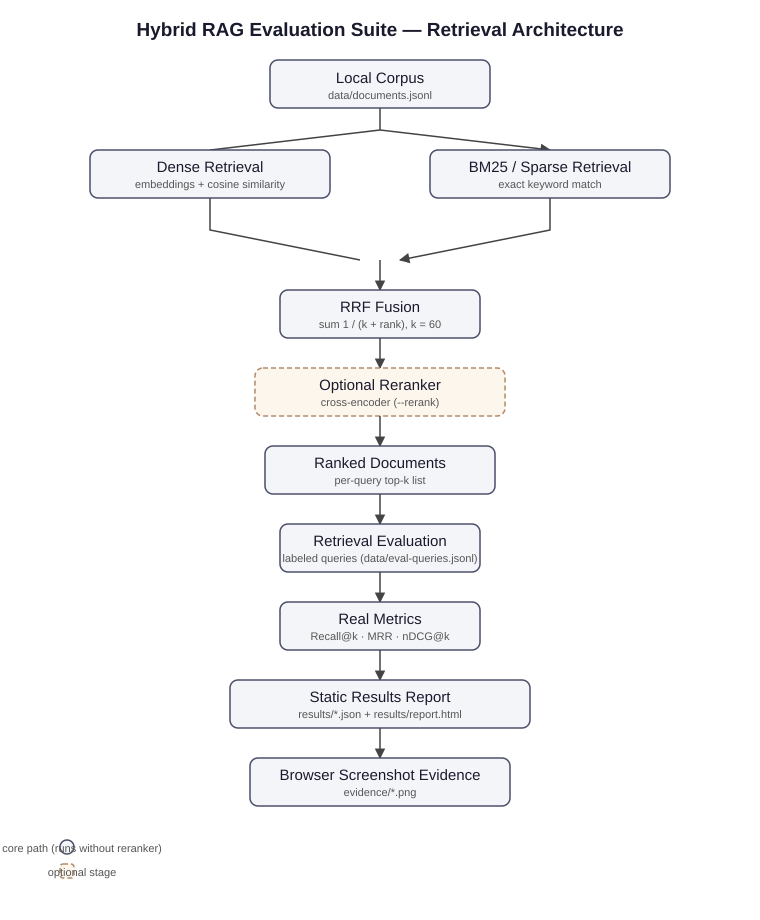
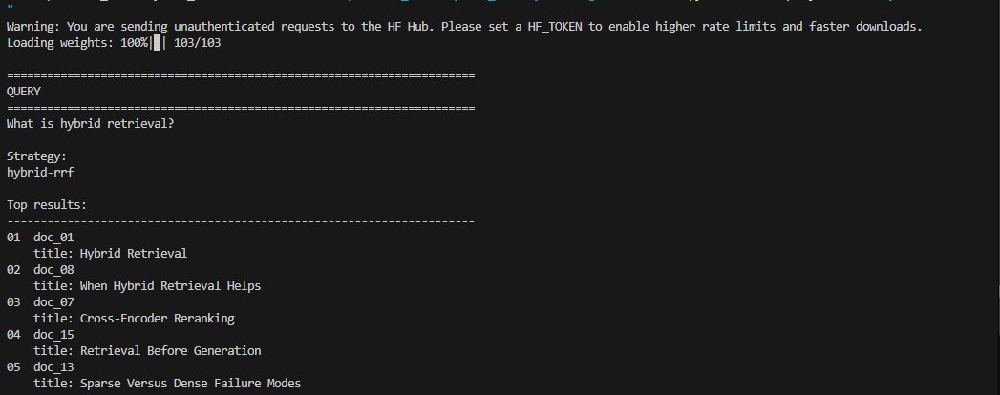
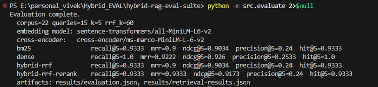
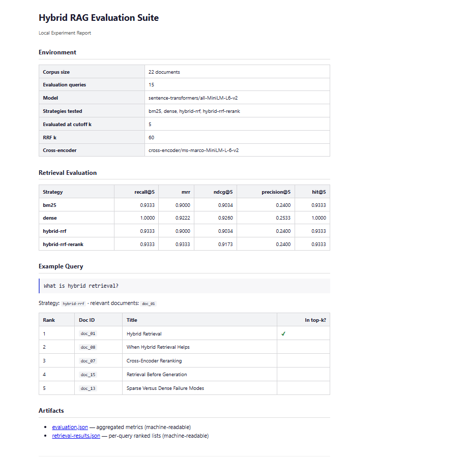
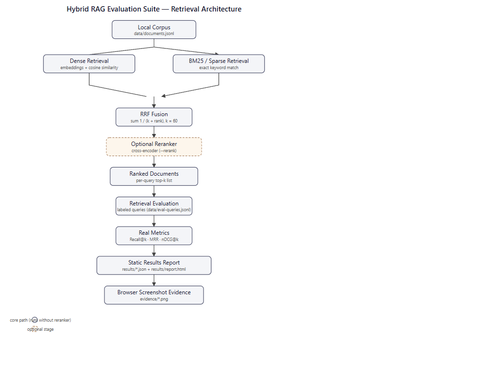

# Hybrid RAG Evaluation Suite

A small, locally runnable evaluation harness for **hybrid retrieval**: dense vector retrieval, BM25 sparse retrieval, and Reciprocal Rank Fusion (RRF), measured with real retrieval metrics on a bundled labeled dataset.

## What This Demonstrates

- **Dense retrieval** — sentence embeddings (`all-MiniLM-L6-v2` by default) with cosine similarity, CPU-only
- **BM25 sparse retrieval** — plain-Python Okapi BM25, no external search service
- **RRF fusion** — rank-based fusion of the two lists: `score = Σ 1 / (k + rank)`, k = 60
- **Optional reranking** — cross-encoder reranker applied on top of the fused list (`--rerank`)
- **Retrieval evaluation** — Recall@k, MRR, nDCG@k, Precision@k, Hit@k over 15 labeled queries

## Architecture



## Quick Start (Windows PowerShell)

```powershell
python -m venv .venv
.\.venv\Scripts\Activate.ps1
python -m pip install --upgrade pip
pip install -r requirements.txt
```

The first run downloads the embedding model (~90 MB) to `~/.cache/huggingface`. No API keys are needed; the reranker cross-encoder is only downloaded when `--rerank` is used.

## Run a Query

```powershell
python -m src.query "What is hybrid retrieval?"
```

With optional reranking:

```powershell
python -m src.query "What is hybrid retrieval?" --rerank
```

## Evaluate

```powershell
python -m src.evaluate
python -m src.report
```

`src.evaluate` runs all four strategies over the bundled evaluation set and writes `results/evaluation.json` + `results/retrieval-results.json`. `src.report` renders those artifacts into `results/report.html`.

## Results

Last local run (22 docs, 15 queries, k=5, RRF k=60, all-MiniLM-L6-v2):

| Strategy | Recall@5 | MRR | nDCG@5 |
| --- | --- | --- | --- |
| BM25 | 0.9333 | 0.9000 | 0.9034 |
| Dense | 1.0000 | 0.9222 | 0.9260 |
| Hybrid RRF | 0.9333 | 0.9000 | 0.9034 |
| Hybrid + Reranker | 0.9333 | 0.9333 | 0.9173 |

On this small corpus dense retrieval is already strong; the reranker improves MRR over plain fusion. Full machine-readable artifacts:

- [results/evaluation.json](results/evaluation.json)
- [results/retrieval-results.json](results/retrieval-results.json)
- [results/report.html](results/report.html) — open locally, e.g. `python -m http.server 8000` then `http://localhost:8000/results/report.html`

## Evidence

Real screenshots captured from local runs of this repository (see [evidence/README.md](evidence/README.md)):

### Local hybrid query



Real local run showing the hybrid-rrf strategy returning ranked documents for the query "What is hybrid retrieval?".

### Retrieval evaluation



`python -m src.evaluate` executed against the bundled local evaluation set, printing per-strategy Recall@5, MRR, nDCG@5, Precision@5, and Hit@5.

### Browser experiment report



The static report generated from the actual result artifacts, viewed locally.

### Architecture



The retrieval architecture diagram rendered in a browser.

## Design Notes

- **Why hybrid retrieval:** BM25 and dense retrieval fail in complementary ways. BM25 misses paraphrases ("chronic late payers" vs "delinquent accounts"); dense retrieval misses rare exact identifiers (`job_7841`, `AR_90_PLUS`). The bundled corpus includes both styles plus noise documents so this is measurable.
- **Why RRF:** raw BM25 scores and cosine similarities are on incompatible scales; rank positions are directly comparable. RRF fuses lists using only ranks, with `1/(k + rank)` damping top ranks. k=60 is a common convention, not a proven optimum.
- **Why evaluate retrieval first:** in RAG, generation can only use what retrieval fetched. Measuring Recall@k before tuning prompts or models tells you whether the right evidence was even available.

## Limitations

- Small bundled corpus (22 documents) — metrics on 15 queries are illustrative, not a benchmark.
- CPU-focused local demonstration; not a production search service.
- RRF k and all model choices are defaults, not tuned.
- The reranker downloads a second model (~90 MB) and is optional.

## Repository Layout

```
hybrid-rag-eval-suite/
├── README.md
├── requirements.txt
├── .gitignore
├── data/
│   ├── documents.jsonl          # 22 sample documents
│   └── eval-queries.jsonl       # 15 queries with relevant_ids labels
├── src/
│   ├── data.py                  # corpus + query loaders
│   ├── retrieval.py             # BM25, dense, reranker, RRF, metrics
│   ├── evaluate.py              # evaluation entry point
│   ├── query.py                 # single-query CLI
│   ├── report.py                # HTML report renderer
│   └── report_template.html     # static report template
├── docs/
│   └── architecture.svg
├── results/
│   ├── evaluation.json          # generated: aggregated metrics
│   ├── retrieval-results.json   # generated: per-query ranked lists
│   └── report.html              # generated: static browser report
└── evidence/
    └── README.md                # screenshot index (captured locally)
```

## Author

**Avivek Dwivedi** — [GitHub](https://github.com/avivek-dwivedi) · [Repository](https://github.com/avivek-dwivedi/hybrid-rag-eval-suite)