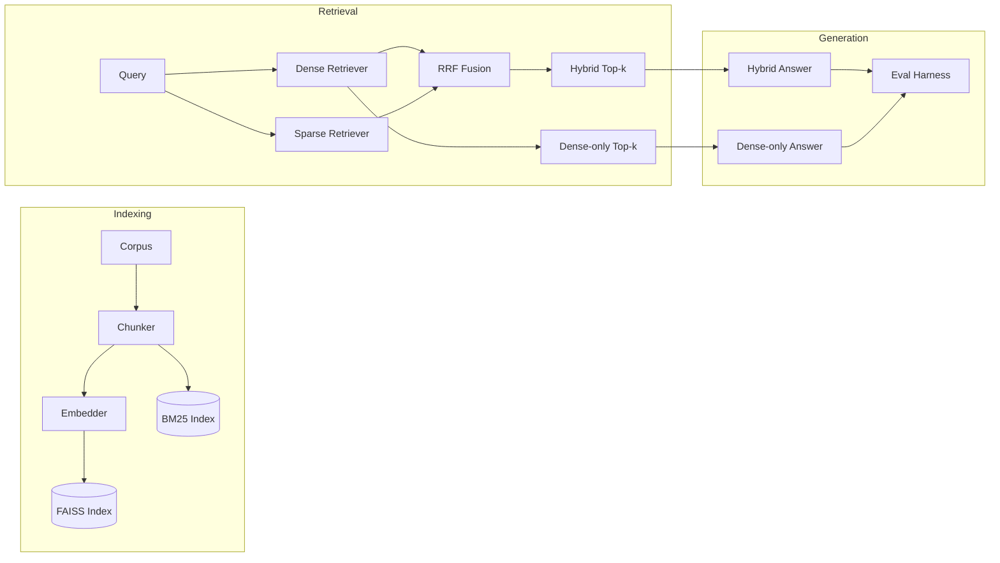
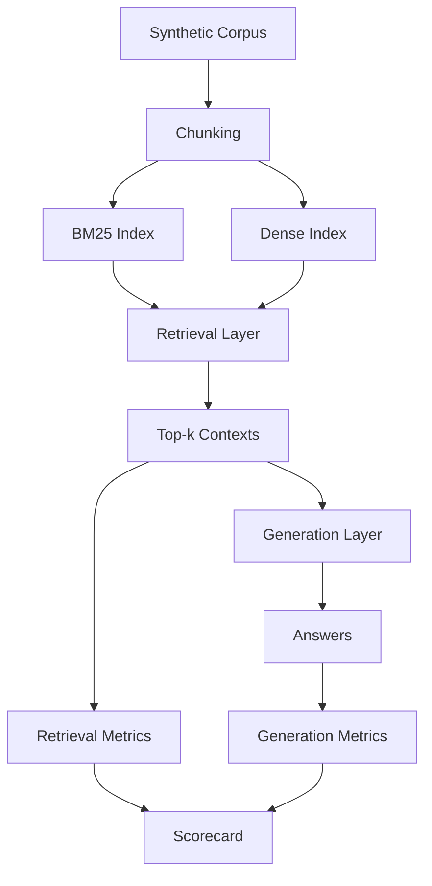

# Hybrid RAG Eval Suite

[](https://www.python.org/)
[](https://jupyter.org/)
[](https://python.langchain.com/)
[](https://docs.ragas.io/)
[](https://github.com/avivek-dwivedi/hybrid-rag-eval-suite)
[](https://github.com/avivek-dwivedi/hybrid-rag-eval-suite/stargazers)

> A reproducible evaluation harness for **Hybrid Retrieval-Augmented Generation** pipelines. Compares dense retrieval, BM25 sparse retrieval, and their Reciprocal Rank Fusion (RRF) hybrid — measured with retrieval metrics, generation metrics, Ragas, and an optional LLM-as-judge.

---

## Why this exists

Production RAG systems fail in two distinct places: **retrieval** (wrong chunks) and **generation** (right chunks, wrong answer). Most public RAG demos measure only the latter. This suite isolates both layers and reports them separately, so you can debug a regression without guessing where it came from.

The pipeline follows a strict layering principle:



---

## Framework overview



Each layer is independently measurable. A drop in the final scorecard points to exactly one layer.

---

## Repository layout

```
hybrid-rag-eval-suite/
|-- hybrid_rag_demo.ipynb          # End-to-end demo: dense vs hybrid vs LLM judge
|-- hybrid_rag_evaluation.ipynb    # Full evaluation harness with scorecards
|-- hybrid_rag_theory.ipynb        # Reference notes: BM25, RRF, BLEU, NDCG, MRR
|-- synthetic_rag_dataset.csv      # Flat synthetic corpus + queries
|-- synthetic_rag_dataset.jsonl    # JSONL view, same data
|-- requirements.txt               # Pinned pip dependencies
|-- environment.yml                # Conda mirror of requirements.txt
|-- .env.example                   # Template for optional Groq config
`-- README.md
```

---

## What is implemented

### 1. Retrieval layer

| Retriever | Algorithm | Notes |
| --- | --- | --- |
| Dense | FAISS over sentence embeddings | Strong on semantic / paraphrase match |
| Sparse | BM25 (rank-bm25) | Strong on exact-token / keyword match |
| Hybrid | Reciprocal Rank Fusion over both | Parameter-free rank fusion |

### 2. Generation layer

- **Extractive fallback** — runs without any external LLM
- **Groq-backed generation** — optional, via `langchain-groq`

### 3. Evaluation layer

**Retrieval metrics**

- Source precision@k, source recall@k
- Chunk precision@k, chunk recall@k
- Top-1 source correctness, first relevant rank
- MRR, NDCG@k
- Ragas context precision, Ragas context recall

**Generation metrics**

- Manual exact match
- Required-fact recall, all-required-facts-present, forbidden-fact hits
- Answer-context overlap
- Ragas exact match, Ragas BLEU, Ragas ROUGE
- LLM judge: groundedness, alignment, completeness

---

## Installation

### Option A — venv (recommended for development)

```bash
# clone
git clone https://github.com/avivek-dwivedi/hybrid-rag-eval-suite.git
cd hybrid-rag-eval-suite

# create + activate
python -m venv .venv
source .venv/bin/activate           # macOS / Linux
# .\.venv\Scripts\Activate.ps1     # Windows PowerShell

# install
pip install --upgrade pip
pip install -r requirements.txt
python -m ipykernel install --user --name hybrid-rag-eval \
        --display-name "Python (hybrid-rag-eval)"
```

### Option B — conda

```bash
conda env create -f environment.yml
conda activate hybrid-rag-eval
python -m ipykernel install --user --name hybrid-rag-eval \
        --display-name "Python (hybrid-rag-eval)"
```

Refresh an existing environment:

```bash
conda env update -f environment.yml --prune
```

---

## Configuration

The notebooks run end-to-end with **zero external services**. The Groq integration is only enabled if you provide credentials.

```bash
cp .env.example .env
```

| Variable | Required | Purpose |
| --- | --- | --- |
| `GROQ_API_KEY` | no | Enables Groq-based generation and LLM judge |
| `GROQ_MODEL` | no | Overrides the default Groq model |

---

## Usage

Run the notebooks in this order:

1. `hybrid_rag_demo.ipynb` — end-to-end pipeline, side-by-side dense vs hybrid answers, LLM judge
2. `hybrid_rag_evaluation.ipynb` — full retrieval + generation metric suite with scorecards
3. `hybrid_rag_theory.ipynb` — reference notes for every metric and algorithm used

Start Jupyter:

```bash
jupyter notebook
```

---

## Reproducibility

- The corpus and queries are synthetic and version-controlled, so retrieval runs are deterministic across machines.
- Groq-backed generation is non-deterministic by nature and varies by model and time.
- Without `GROQ_API_KEY`, the pipeline falls back to extractive answers and the full metric suite still runs.
- NLTK tokenizers are downloaded on first run only.

---

## Pinned dependencies

| Package | Version | Role |
| --- | --- | --- |
| langchain | 1.2.18 | Orchestration |
| langchain-core | 1.3.3 | Core abstractions |
| langchain-community | 0.4.1 | Community integrations |
| langchain-text-splitters | 1.1.1 | Chunking |
| langchain-groq | 1.1.2 | Optional Groq LLM backend |
| ragas | 0.4.3 | Ragas metric suite |
| rank-bm25 | 0.2.2 | BM25 sparse retriever |
| sacrebleu | 2.5.1 | BLEU generation metric |
| rouge-score | 0.1.2 | ROUGE generation metric |
| nltk | 3.9.3 | Tokenization |
| pandas | 3.0.1 | Data handling |
| pydantic | 2.11.10 | Schema validation |
| python-dotenv | 1.2.2 | `.env` loading |

See [requirements.txt](requirements.txt) for the canonical list and [environment.yml](environment.yml) for the conda mirror.

---

## Roadmap

- [ ] Cross-encoder reranking on top of hybrid retrieval
- [ ] Dense retriever baseline numbers reported alongside BM25
- [ ] CSV / Markdown export of scorecards
- [ ] Side-by-side pipeline comparison cells in the demo notebook
- [ ] Containerized notebook environment
- [ ] CI hook that runs the synthetic eval on every commit

---

## License

Released without a license file — all rights reserved by the author. Add a `LICENSE` file before publishing publicly if you intend to grant reuse rights.

---

## Author

**Avivek Dwivedi** — AI Engineer working on retrieval systems, evaluation harnesses, and applied LLM tooling.

- GitHub: [@avivek-dwivedi](https://github.com/avivek-dwivedi)
- Repository: [hybrid-rag-eval-suite](https://github.com/avivek-dwivedi/hybrid-rag-eval-suite)